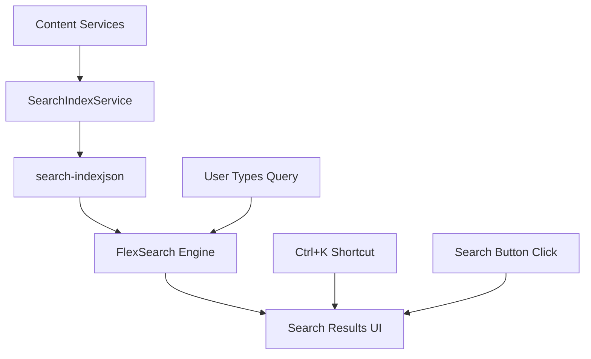

MyLittleContentEngine includes a built-in search system that automatically indexes your content and provides fast, client-side search functionality. The search system uses FlexSearch for high-performance searching with smart ranking and highlighting.

## How Search Works

The search system consists of three main components:

1. **Server-side Index Generation**: Automatically creates a JSON search index from all your content
2. **Client-side Search Engine**: Uses FlexSearch to provide fast, fuzzy searching
3. **Search UI**: Modal interface with keyboard shortcuts and result highlighting

### Architecture Overview



**Content Processing Flow:**
1. Content services (Markdown, API Reference) provide pages via `GetPagesToGenerateAsync()`
2. `SearchIndexService` fetches each page's HTML and extracts searchable content
3. Content is cleaned (code blocks removed), headings are extracted with priority levels
4. A JSON index is generated at `/search-index.json` with weighted content and search priorities
5. Client-side FlexSearch loads the index and provides instant search results

## Prerequisites

- MyLittleContentEngine site with content
- `MyLittleContentEngine.UI` package installed
- Search UI components added to your layout

## Implementation Steps

<Steps>
<Step stepNumber="1">
## Add Required Packages

Ensure you have the UI package installed:

```bash
dotnet add package MyLittleContentEngine.UI
```

The search functionality is automatically included with the UI package - no additional setup required.
</Step>

<Step stepNumber="2">
## Add Search UI to Your Layout

Add a search input element to your layout with the `id="search-input"`:

```html
<button type="button" id="search-input" class="w-full rounded-md">
    Search documentation...
</button>

```

The search system will automatically:
- Generate a search modal when the input is clicked
- Enable `Ctrl+K` keyboard shortcut
- Provide search results with highlighting
</Step>

<Step stepNumber="3">
## Include Scripts and Base URL

In your `App.razor`, ensure you have the required scripts and base URL configuration:

```html
<head>
    <!-- Other head content -->
    <script src="@LinkService.GetLink("/_content/MyLittleContentEngine.UI/scripts.js")" defer></script>
    
    <script>
        // Set global base URL for scripts to use (required for subdirectory deployments)
        window.MyLittleContentEngineBaseUrl = '@LinkService.GetLink("/")';
    </script>
</head>
```

Don't forget to inject the LinkService:

```csharp
@inject LinkService LinkService
```
</Step>

<Step stepNumber="4">
## Configure Content Service Priorities (Optional)

Content services have configurable search priorities that affect result ranking:

- **MarkdownContentService**: Priority 10 (high) - documentation and guides appear first
- **ApiReferenceContentService**: Priority 5 (medium) - API docs appear after main content

To customize priorities for custom content services, implement the `SearchPriority` property:

```csharp
public class MyCustomContentService : IContentService
{
    public int SearchPriority => 8; // Custom priority (1-10 range recommended)
    
    // Other implementation...
}
```
</Step>
</Steps>

## Search Features

### Intelligent Content Ranking

The search system uses multiple factors to rank results:

1. **Field Weights**: Title (3x) > Description (2x) > Headings (1.5x) > Content (1x)
2. **Heading Priority**: H1 headings weighted higher than H2, H3, etc.
3. **Content Service Priority**: Markdown content ranked higher than API reference
4. **Position in Results**: Earlier matches in FlexSearch results get higher scores

### Smart Content Processing

- **Code Block Removal**: Code samples are excluded from search content for cleaner results
- **Heading Extraction**: Headings are extracted with level-based priority weighting
- **HTML Cleaning**: Scripts, styles, and markup are removed, leaving clean searchable text
- **Optimized Index**: Headings stored as `"level:text"` format for efficient client-side processing

### Search UI Features

- **Modal Interface**: Clean, focused search experience
- **Keyboard Shortcuts**: `Ctrl+K` (Windows/Linux) or `Cmd+K` (Mac) to open search
- **Live Search**: Results appear as you type with 300ms debounce
- **Result Highlighting**: Search terms highlighted in titles, descriptions, and content snippets
- **Failure Handling**: Graceful degradation with clear error messages, no retry storms

## Customization

### Styling

The search interface uses semantic CSS classes that are automatically styled by MonorailCSS:

- `.search-modal-backdrop` - Modal overlay
- `.search-modal-content` - Modal container
- `.search-result-item` - Individual search results
- `.search-highlight` - Highlighted search terms

Customize the appearance by adding CSS rules in your stylesheets or via MonorailCSS configuration.

### Search Index Endpoint

The search index is automatically available at `/search-index.json` and includes:

```json
{
  "documents": [
    {
      "url": "/page-url",
      "title": "Page Title", 
      "description": "Page description",
      "content": "Clean page content without code blocks",
      "headings": ["1:Main Heading", "2:Sub Heading"],
      "searchPriority": 10
    }
  ],
  "generatedAt": "2024-01-01T00:00:00.000Z"
}
```

## Troubleshooting

**Search modal not appearing:**
- Verify `id="search-input"` is present on your search element
- Check browser console for JavaScript errors
- Ensure `scripts.js` is loading correctly

**Search index not loading:**
- Verify the `/search-index.json` endpoint is accessible
- Check that `MyLittleContentEngineBaseUrl` is set correctly in subdirectory deployments
- Look for network errors in browser developer tools

**No search results:**
- Verify your content services are implementing `GetPagesToGenerateAsync()` correctly
- Check that pages are publicly accessible (search index generation fetches actual HTML)
- Ensure content contains searchable text (not just images or code)

**Subdirectory deployment issues:**
- Ensure `LinkService` is injected in `App.razor` 
- Verify `window.MyLittleContentEngineBaseUrl` is set correctly
- Check that the search index URL resolves to the correct subdirectory

Your search functionality will now provide fast, intelligent search across all your content with automatic indexing and a polished user interface!