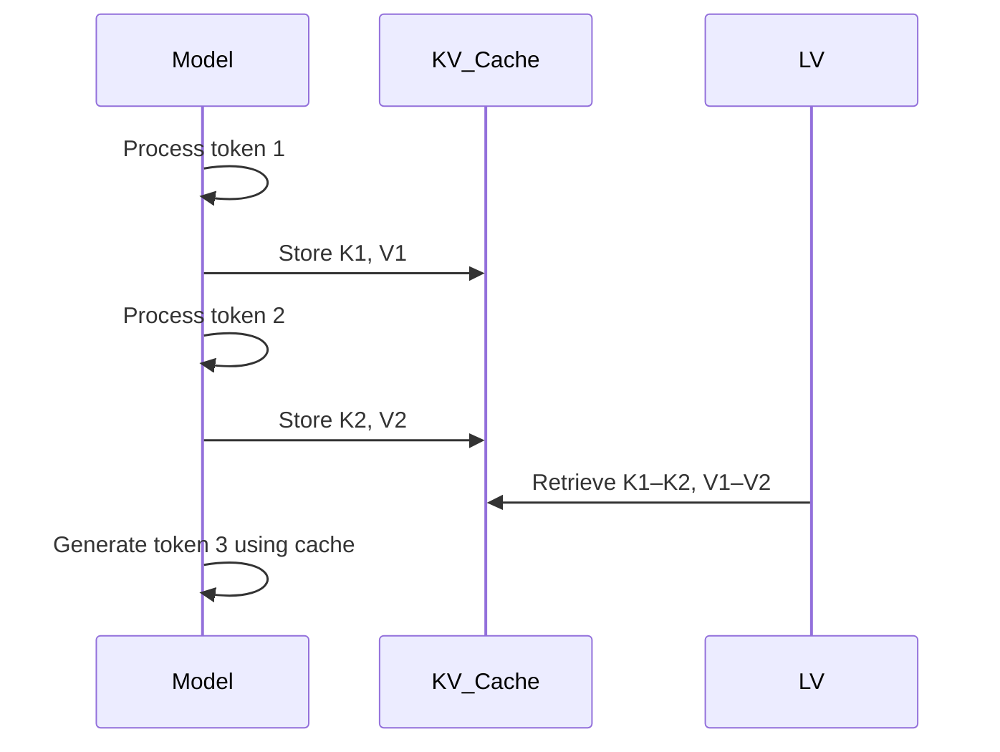

MyLittleContentEngine uses [Markdig](https://github.com/xoofx/markdig) for Markdown processing, which is a powerful and
extensible Markdown parser for .NET. It supports a wide range of Markdown features and extensions, making it suitable
for various content needs.

MyLittleContentEngine supports several Markdown extensions to enhance your content. These extensions provide additional
formatting options and features that are not part of standard Markdig. These extensions merely generate HTML, you'll
still need to style them with CSS to match your site's design. However, `MyLittleContentEngine.MonorailCss` provides some
default values.

## Default Markdig Pipeline

The default Markdig pipeline used by MyLittleContentEngine includes the following extensions:

```csharp:xmldocid,bodyonly
P:MyLittleContentEngine.ContentEngineOptions.MarkdownPipelineBuilder
```

`UseAutoIdentifiers(AutoIdentifierOptions.GitHub)` is critical for generating IDs for headers, which is necessary for
linking to specific sections of the content within the sidebar navigation.

## Code Highlighting

MyLittleContentEngine will try to highlight code blocks based on the language specified in the opening code block
server-side.

The following rules are followed:

1. If the [roslyn is connected](../getting-started/connecting-to-roslyn) and the code block is C# or VB.NET,
   then
   Roslyn's [Microsoft.CodeAnalysis.Classification.Classifier](https://learn.microsoft.com/en-us/dotnet/api/microsoft.codeanalysis.classification.classifier.getclassifiedspans?view=roslyn-dotnet-3.0)
   will be used to highlight the code block. This ensures
   the the latest language features are highlighted correctly.
2. If the code block is bash or shell, a built-in highlighter will be used to highlight command and their options.
3. If the code block a language is supported by [TextMateSharp](https://github.com/danipen/TextMateSharp)'s Grammar
   package,
   then TextMateSharp will be used to highlight the code
   block. [Current Grammars](https://github.com/danipen/TextMateSharp/tree/master/src/TextMateSharp.Grammars/Resources/Grammars)
4. If those rules are not met, then the code block will be rendered with the language set on the code block. Within the
   `MyLittleContentEngine.UI`
   `scripts.js` file, a `highlightCode` function will be used to highlight the code block using
   the [Hightlight.JS](https://highlightjs.org/). This library will only be
   loaded if the code block is not highlighted by the previous rules. This ensures that the page does not load
   unnecessary JavaScript.

## Code Tabs

You can create tabbed content sections using the `tabs` attribute on a code block. This allows you to organize content
into multiple tabs.

Place the `tabs=true` attribute on the opening code block, and the subsequent code blocks will be treated as tab
content.

You can also specify titles for each tab by using the `title` attribute.

``````markdown
```html tabs=true
<p>My Content</p>
```

```xml title="My XML Data"
<data>My Data</data>
```
``````

This will render as:

```html tabs=true
<p>My Content</p>
```

```xml title="My XML Data"

<data>My Data</data>
```

Code blocks will be highlighted according to the rules mentioned above.

## Enhanced Alerts

The Markdig AlertBlock has been tweaked to play nicer with Monorail and Tailwind styling.

### Note

```markdown
> [!NOTE]  
> Highlights information that users should take into account, even when skimming.
```

> [!NOTE]  
> Highlights information that users should take into account, even when skimming.

### Tip

```markdown
> [!TIP]
> Optional information to help a user be more successful.
```

> [!TIP]
> Optional information to help a user be more successful.

### Important

```markdown
> [!IMPORTANT]  
> Crucial information necessary for users to succeed.
```

> [!IMPORTANT]  
> Crucial information necessary for users to succeed.

### Warning

```markdown
> [!WARNING]  
> Critical content demanding immediate user attention due to potential risks.
```

> [!WARNING]  
> Critical content demanding immediate user attention due to potential risks.

### Caution

```markdown
> [!CAUTION]
> Negative potential consequences of an action.
```
> [!CAUTION]
> Negative potential consequences of an action.
> 
## Mermaid Diagrams

MyLittleContentEngine supports [Mermaid](https://mermaid.js.org/) diagrams. If you are using `MyLittleContentEngine.UI`, then
the `scripts.js` file will automatically load the Mermaid library and render the diagrams with your current theme.



## Blazor within Markdown vs Mdazor

Simple blazor components can be used within Markdown content, using
the [Mdazor](https://github.com/phil-scott-78/Mdazor)

Mdazor is a custom Markdig extension that:

* Parses component tags - Recognizes <ComponentName prop="value">content</ComponentName> syntax in your Markdown
* Uses Blazor's HtmlRenderer - Actually renders real Blazor components server-side
* Handles nested content - Markdown inside components gets processed recursively

### Steps Component

It includes a builtin Steps component that can be used to create a step-by-step guide.

To register the component, you need to add the following to your `Program.cs`:

```csharp
builder.Services.AddMdazor()
    .AddMdazorComponent<Step>()
    .AddMdazorComponent<Steps>();
```

Then you can use the component in your Markdown content like this:

```````markdown

## Here is some content that needs steps.

To do the action, follow these steps:

<Steps>
<Step stepNumber="1">
**The First Thing to Do**

This is the first step in the process.

It can contain any Markdown content, including **bold text**, *italic text*, and even code blocks.

```csharp
var i = 2+2;
```

</Step>
<Step stepNumber="2">
**The Second Thing to Do**

This is the second step in the process. For these two steps, the code is using
bold tags, but you can use Headers instead, and the links will still appear
in the sidebar.

</Step>
</Steps>
```````

This will render as:

<Steps>
<Step stepNumber="1">
**The First Thing to Do**

This is the first step in the process.

It can contain any Markdown content, including **bold text**, *italic text*, and even code blocks.

```csharp
var i = 2+2;
```

</Step>
<Step stepNumber="2">
**The Second Thing to Do**

This is the second step in the process. For these two steps, the code is using
bold tags, but you can use Headers instead, and the links will still appear
in the sidebar.

</Step>
</Steps>

### Card Components

MyLittleContentEngine.UI includes a set of card components that work together to create attractive content layouts. These components integrate seamlessly with Mdazor to provide flexible grid-based content organization.

To register the card components, add the following to your `Program.cs`:

```csharp
builder.Services.AddMdazor()
    .AddMdazorComponent<CardGrid>()
    .AddMdazorComponent<Card>()
    .AddMdazorComponent<LinkCard>();
```

#### CardGrid Component

The `CardGrid` component creates a responsive grid container for organizing cards. It automatically adjusts the number of columns based on screen size.

**Parameters:**
- `Columns` (string, default: "2") - Number of columns for the grid on larger screens
- `ChildContent` (RenderFragment) - The card content to display in the grid

#### Card Component

The `Card` component creates a styled content card with optional icon and title.

**Parameters:**
- `Title` (string, optional) - The card title displayed prominently at the top
- `Color` (string, default: "primary") - Color theme for the card styling
- `Icon` (RenderFragment, optional) - Icon content displayed next to the title
- `ChildContent` (RenderFragment) - The main card content

#### LinkCard Component

The `LinkCard` component extends the Card component by wrapping it in a clickable link.

**Parameters:**
- `Title` (string, optional) - The card title displayed prominently at the top
- `Href` (string, optional) - The URL the card should link to
- `Color` (string, default: "primary") - Color theme for the card styling
- `Icon` (RenderFragment, optional) - Icon content displayed next to the title
- `ChildContent` (RenderFragment) - The main card content

#### Usage Example

Here's how to create a grid of link cards for navigation:

```````markdown
<CardGrid>
<LinkCard Title="Creating First Site" href="getting-started/creating-first-site">
<Icon>
<svg xmlns="http://www.w3.org/2000/svg" viewBox="0 0 24 24" width="2em" height="2em" stroke="currentColor">
    <path d="M8 4.5V3M16 4.5V3" stroke="currentColor" stroke-width="1.5" stroke-linecap="round" stroke-linejoin="round"></path>
    <path d="M8 11C8 9.58579 8 8.87868 8.43934 8.43934C8.87868 8 9.58579 8 11 8H13C14.4142 8 15.1213 8 15.5607 8.43934C16 8.87868 16 9.58579 16 11V13C16 14.4142 16 15.1213 15.5607 15.5607C15.1213 16 14.4142 16 13 16H11C9.58579 16 8.87868 16 8.43934 15.5607C8 15.1213 8 14.4142 8 13V11Z" stroke="currentColor" stroke-width="1.5"></path>
</svg>
</Icon>
Build a complete content site from scratch using MyLittleContentEngine
</LinkCard>

<LinkCard Title="Connecting to Roslyn" href="getting-started/connecting-to-roslyn" Color="secondary">
<Icon>
<svg xmlns="http://www.w3.org/2000/svg" viewBox="0 0 24 24" width="2em" height="2em">
    <path d="M4.51255 19.4866C7.02498 21.8794 10.016 20.9223 11.2124 19.9532" stroke="currentColor" stroke-width="1.5" stroke-linecap="round"></path>
</svg>
</Icon>
Integrate Roslyn for enhanced code highlighting and documentation
</LinkCard>
</CardGrid>
```````

You can also use the `Card` component without links for static content displays:

```````markdown
<CardGrid Columns="3">
<Card Title="Feature One" Color="primary">
<Icon>
<!-- Your SVG icon here -->
</Icon>
This card describes an important feature of your application.
</Card>

<Card Title="Feature Two" Color="accent">
<Icon>
<!-- Your SVG icon here -->
</Icon>
Another key feature with different color styling.
</Card>

<Card Title="Feature Three">
A card without an icon, showing just title and content.
</Card>
</CardGrid>
```````

#### Color Options

Both `Card` and `LinkCard` support color theming through the `Color` parameter. The available colors depend on your CSS framework configuration, but common options include:

- `primary` (default) - Primary brand color
- `secondary` - Secondary brand color  
- `accent` - Accent color
- `neutral` - Neutral gray tones

#### Responsive Behavior

The `CardGrid` component automatically adjusts its layout:

- Mobile devices: Single column layout
- Tablets and larger: Uses the specified `Columns` value (default: 2)

This ensures your card layouts look great across all device sizes without requiring additional configuration.

