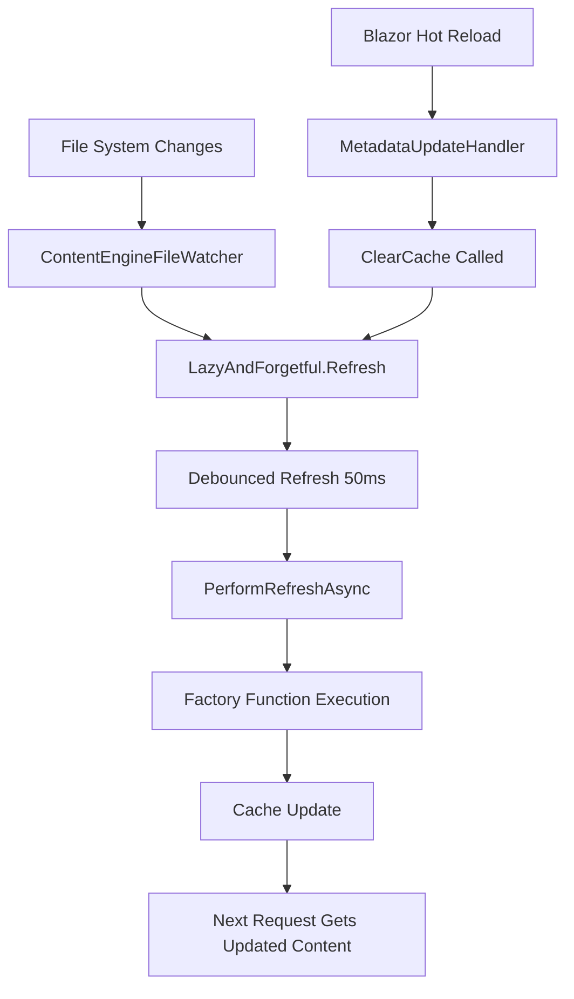

MyLittleContentEngine provides seamless hot reload functionality during development, allowing content changes to be reflected immediately without restarting the application. This capability is built on two key infrastructure components working together: **LazyAndForgetful** for intelligent caching and **ContentEngineFileWatcher** for file system monitoring.

## Architecture Overview

All built-in `IContentServices` adhere to the hot reload system, which operates on a simple but powerful principle:

1. Process site wide on reload
2. Process page wide on demand

For example, when you edit a markdown file, it could cause many different things to update beyond just its content:

- The Home Page
- Site navigation
- Tag lists
- xRef links
- Next/Previous pages

For example, in the Markdown `IContentService`, when a change is detected, we reread every Markdown file and parse only the front matter. We'll defer rendering the Markdown to HTML until the page is actually requested. This gives us two benefits:

1. **Performance**: Not that Markdig is slow, but between server-side syntax highlighting and Roslyn-connected operations, things can start to add up
2. **Full site context**: Our Markdig extensions and link resolvers have a full site to reference when rendering. This is critical for cross-references and other link rewriting operations. 



## LazyAndForgetful: Smart Caching

The `LazyAndForgetful<T>` class is a thread-safe, lazy-loading cache that can "forget" its value and reload it on demand. It's designed specifically for expensive operations that need to be invalidated when dependencies change.

For example, it's used to cache the results of processing markdown files into a dictionary of content pages. It's also used in the caching of the MSBuild workspace that drives the Roslyn interactions. This allows these expensive operations to be performed once with the ability to refresh the cache when the underlying files change.

### Key Features

- **Lazy Loading**: Values are computed only when first accessed
- **Thread Safety**: Safe for concurrent access from multiple threads
- **Debounced Refresh**: Multiple refresh requests are coalesced to prevent excessive recomputation
- **Async-First**: Built for async operations throughout

### Usage Pattern

```csharp
// Create a lazy cache with expensive factory operation
var contentCache = new LazyAndForgetful<ConcurrentDictionary<string, MarkdownContentPage<TFrontMatter>>>(
    async () => await ProcessAllMarkdownFiles()
);

// Access cached value (computed on first access)
var content = await contentCache.Value;

// Invalidate cache when files change
contentCache.Refresh(); // Triggers debounced recomputation
```

### Debouncing Logic

The debouncing mechanism prevents excessive recomputation during rapid file changes:

- **Default Delay**: 50ms (configurable)
- **Coalescing**: Multiple refresh calls within the debounce window are combined
- **Cancellation**: New refresh requests cancel pending ones

This is particularly important during development when editors might save files multiple times in quick succession or when batch operations modify many files.

## ContentEngineFileWatcher: File System Monitoring

The `ContentEngineFileWatcher` monitors specified directories for file changes and triggers refresh operations. It supports both specific file pattern watching and general directory monitoring, with comprehensive integration into Blazor's hot reload system.

### File System Watching Features

- **Pattern-Based Watching**: Monitor specific file types (e.g., `*.md`, `*.razor`)
- **Directory Watching**: Monitor entire directories for any file changes
- **Subdirectory Support**: Optionally include subdirectories in watch operations
- **Multiple Event Types**: Responds to file changes, creation, deletion, and renaming
- **Duplicate Protection**: Prevents duplicate watchers for the same path/pattern combinations

### Blazor Hot Reload Integration

The watcher includes special support for Blazor's hot reload mechanism through the [`MetadataUpdateHandler`](https://learn.microsoft.com/en-us/dotnet/api/system.reflection.metadata.metadataupdatehandlerattribute?view=net-9.0) attribute:

```csharp
[assembly: MetadataUpdateHandler(typeof(ContentEngineFileWatcher))]
```

This integration provides:

- **IDE Integration**: Works with Visual Studio and VS Code hot reload
- **dotnet watch Support**: Automatic refresh when using `dotnet watch`
- **Metadata Updates**: Responds to C# code changes that affect content processing
- **Cache Clearing**: Automatically clears content caches when code changes

### Watch Types

The file watcher supports two primary watch patterns:

#### 1. Specific File Pattern Watching
```csharp
// Watch for specific file types with path information
fileWatcher.AddPathWatch(
    path: "Content/Blog", 
    filePattern: "*.md", 
    onFileChanged: (filePath) => ProcessSpecificFile(filePath),
    includeSubdirectories: true
);
```

#### 2. General Directory Watching
```csharp
// Watch entire directories for any changes
fileWatcher.AddPathsWatch(
    paths: ["Content", "wwwroot"], 
    onUpdate: () => RefreshAllContent(),
    includeSubdirectories: true
);
```

## Integration in Content Services

The hot reload architecture is seamlessly integrated into content services. Here's how it works in practice:

### MarkdownContentService Example

```csharp
public class MarkdownContentService<TFrontMatter> : IMarkdownContentService<TFrontMatter>
{
    private readonly LazyAndForgetful<ConcurrentDictionary<string, MarkdownContentPage<TFrontMatter>>> _contentCache;

    public MarkdownContentService(
        ContentEngineContentOptions<TFrontMatter> engineContentOptions,
        IContentEngineFileWatcher fileWatcher,
        // ... other services
    )
    {
        // Set up lazy cache with expensive content processing operation
        _contentCache = new LazyAndForgetful<ConcurrentDictionary<string, MarkdownContentPage<TFrontMatter>>>(
            async () => await _contentProcessor.ProcessContentFiles()
        );

        // Set up file watching to trigger cache refresh
        fileWatcher.AddPathsWatch([engineContentOptions.ContentPath], NeedsRefresh);
    }

    private void NeedsRefresh() => _contentCache.Refresh();

    public async Task<MarkdownContentPage<TFrontMatter>?> GetContentPageByUrlOrDefault(string url)
    {
        var data = await _contentCache.Value; // May trigger recomputation if cache was invalidated
        return data.GetValueOrDefault(url);
    }
}
```

### Workflow

1. **Initial Load**: First content access triggers expensive processing operation
2. **File Change**: Developer modifies a markdown file or source code
3. **Detection**: `ContentEngineFileWatcher` detects the change
4. **Invalidation**: Calls `NeedsRefresh()` which triggers `_contentCache.Refresh()`
5. **Debouncing**: If multiple changes occur rapidly, they're coalesced
6. **Reprocessing**: After debounce delay, content is reprocessed
7. **Cache Update**: New content replaces cached values
8. **UI Refresh**: Next page request gets updated content

The hot reload architecture provides a solid foundation for productive development workflows while maintaining excellent performance characteristics through intelligent caching and efficient file system monitoring.
