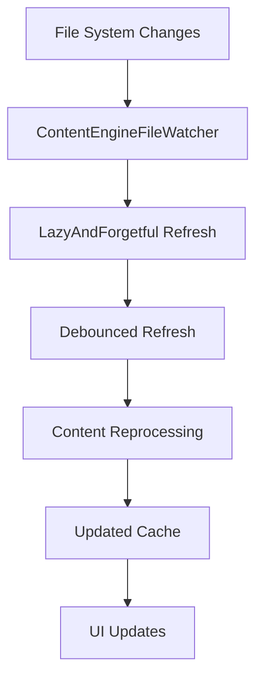

MyLittleContentEngine provides seamless hot reload functionality during development, allowing content changes to be
reflected immediately without restarting the application. This capability is built on two key infrastructure components
working together: **LazyAndForgetful** for intelligent caching and **ContentEngineFileWatcher** for file system
monitoring.

## Architecture Overview

The hot reload system operates on a simple but powerful principle: expensive operations (like parsing all markdown
files) are cached until invalidated by file changes, at which point they are recomputed with debouncing to prevent
excessive recalculation.



## LazyAndForgetful: Smart Caching

The `LazyAndForgetful<T>` class is a thread-safe, lazy-loading cache that can "forget" its value and reload it on
demand. It's designed specifically for expensive operations that need to be invalidated when dependencies change.

For example, it is used to cache the results of processing markdown files into a dictionary of content pages. It is also
used in the caching of the MSBuild workspace that drives the Roslyn interactions. This allows for these expensive
operations
to be performed once with the ability to refresh the cache when the underlying files change.

### Key Features

- **Lazy Loading**: Values are computed only when first accessed
- **Thread Safety**: Safe for concurrent access from multiple threads
- **Debounced Refresh**: Multiple refresh requests are coalesced to prevent excessive recomputation
- **Async-First**: Built for async operations throughout

### Usage Pattern

```csharp
// Create a lazy cache with expensive factory operation
var contentCache = new LazyAndForgetful<ConcurrentDictionary<string, MarkdownContentPage<TFrontMatter>>>(
    async () => await ProcessAllMarkdownFiles()
);

// Access cached value (computed on first access)
var content = await contentCache.Value;

// Invalidate cache when files change
contentCache.Refresh(); // Triggers debounced recomputation
```

### Debouncing Logic

The debouncing mechanism prevents excessive recomputation during rapid file changes:

- **Default Delay**: 50ms (configurable)
- **Coalescing**: Multiple refresh calls within the debounce window are combined
- **Cancellation**: New refresh requests cancel pending ones

This is particularly important during development when editors might save files multiple times in quick succession or
when batch operations modify many files.

## ContentEngineFileWatcher: File System Monitoring

The `ContentEngineFileWatcher` monitors specified directories for file changes and triggers refresh operations. It
supports both specific file pattern watching and general directory monitoring.

The watcher includes special support for Blazor's hot reload mechanism through the
[
`MetadataUpdateHandler`](https://learn.microsoft.com/en-us/dotnet/api/system.reflection.metadata.metadataupdatehandlerattribute?view=net-9.0)
attribute, enabling integration with IDE and `dotnet watch` tooling.

## Integration in Content Services

The hot reload architecture is seamlessly integrated into content services. Here's how it works in practice:

### MarkdownContentService Example

```csharp
public class MarkdownContentService<TFrontMatter> : IMarkdownContentService<TFrontMatter>
{
    private readonly LazyAndForgetful<ConcurrentDictionary<string, MarkdownContentPage<TFrontMatter>>> _contentCache;

    public MarkdownContentService(
        ContentEngineContentOptions<TFrontMatter> engineContentOptions,
        IContentEngineFileWatcher fileWatcher,
        // ... other services
    )
    {
        // Set up lazy cache with expensive content processing operation
        _contentCache = new LazyAndForgetful<ConcurrentDictionary<string, MarkdownContentPage<TFrontMatter>>>(
            async () => await _contentProcessor.ProcessContentFiles()
        );

        // Set up file watching to trigger cache refresh
        fileWatcher.AddPathsWatch([engineContentOptions.ContentPath], NeedsRefresh);
    }

    private void NeedsRefresh() => _contentCache.Refresh();

    public async Task<MarkdownContentPage<TFrontMatter>?> GetContentPageByUrlOrDefault(string url)
    {
        var data = await _contentCache.Value; // May trigger recomputation if cache was invalidated
        return data.GetValueOrDefault(url);
    }
}
```

### Workflow

1. **Initial Load**: First content access triggers expensive processing operation
2. **File Change**: Developer modifies a markdown file or source code
3. **Detection**: `ContentEngineFileWatcher` detects the change
4. **Invalidation**: Calls `NeedsRefresh()` which triggers `_contentCache.Refresh()`
5. **Debouncing**: If multiple changes occur rapidly, they're coalesced
6. **Reprocessing**: After debounce delay, content is reprocessed
7. **Cache Update**: New content replaces cached values
8. **UI Refresh**: Next page request gets updated content


