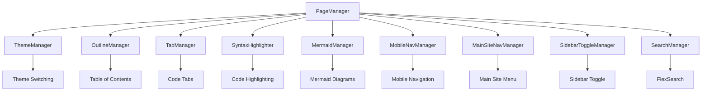

MyLittleContentEngine includes a modular JavaScript system that provides interactive functionality for documentation sites. The architecture uses a **class-based design** with centralized management through the `PageManager`.

## Architecture Overview

The JavaScript system is organized into specialized managers:

## Component Managers

### PageManager

The `PageManager` coordinates all interactive functionality. It handles DOM ready state detection, initializes all component managers, and is available globally as `window.pageManager` for debugging.

### ThemeManager

Manages dark/light theme switching with localStorage persistence. Automatically binds to elements with the `data-theme-toggle` attribute and notifies other managers (like MermaidManager) when the theme changes.

### OutlineManager

Provides scroll-based table of contents navigation with active section highlighting. Uses efficient scroll detection with `requestAnimationFrame` and maintains a visual highlighter that tracks the current section. Can dynamically generate outlines from H2/H3 headings or use pre-rendered markup.

### TabManager

Handles tabbed code blocks with full ARIA accessibility support. Manages tab activation, content panel visibility, and supports multiple tab groups per page through pattern matching.

### SyntaxHighlighter

Provides code syntax highlighting using Highlight.js loaded from CDN. Supports 20+ languages including JavaScript, TypeScript, Python, C#, and more. Only loads when code blocks are present and gracefully handles unsupported languages.

### MermaidManager

Renders Mermaid diagrams with theme-aware styling. Integrates with MonorailCSS color variables and converts OKLCH colors to hex format for Mermaid compatibility. Automatically re-renders diagrams when the theme changes.

### MobileNavManager

Controls mobile navigation sidebar with hamburger menu toggle. Includes overlay backdrop, auto-close on link click (mobile only), escape key support, and prevents body scrolling when open.

### MainSiteNavManager

Manages the main site navigation menu for mobile devices. Auto-closes when window is resized to desktop breakpoint (768px) and includes click-outside and escape key handlers.

### SidebarToggleManager

Handles table of contents sidebar toggle for Spectre.Console-style layouts. Provides overlay-based sidebar with close button and prevents event propagation when clicking inside the panel.

### SearchManager

Implements client-side search using FlexSearch with a modal interface. Features include:

- Keyboard shortcut support (Cmd/Ctrl+K)
- Lazy loading of search index and FlexSearch library
- Weighted field scoring (title > description > headings > content)
- Query highlighting in results
- Snippet generation around matched terms
- Comprehensive error handling

## Key Patterns

### Lazy Loading

External libraries (Mermaid, Highlight.js, FlexSearch) are loaded dynamically from CDN only when needed. This reduces initial page load time and bandwidth usage.

### Theme Coordination

The ThemeManager updates localStorage and the document's `dark` class, then notifies other managers to update their theme-dependent rendering (e.g., Mermaid diagrams).

### CSS Variable Integration

MonorailCSS color variables are read using `getComputedStyle()` and converted from OKLCH to hex format when needed for external libraries.

### Conditional Initialization

Each manager checks for required DOM elements before initializing, ensuring graceful handling of missing features.

### Configuration via Data Attributes

Managers use data attributes for configuration:
- `data-theme-toggle` - Theme toggle buttons
- `data-role="page-outline"` - Outline navigation container
- `data-content-selector` - Content element for outline generation

## Accessibility

All interactive components follow accessibility best practices:

- **ARIA attributes** for tabs, navigation, and modals
- **Keyboard navigation** with Escape key support
- **Focus management** in modals and overlays
- **Screen reader support** through semantic HTML and ARIA labels

## Performance

The architecture optimizes performance through:

- Lazy loading of external dependencies
- `requestAnimationFrame` for scroll-based updates
- Conditional initialization based on DOM content
- Event delegation where appropriate
- Passive event listeners for scroll events