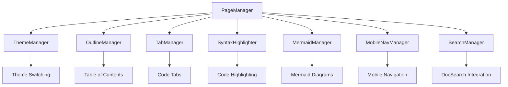

MyLittleContentEngine includes a comprehensive JavaScript system that provides interactive functionality for documentation sites. The architecture is built around a **modular class-based design** with centralized management and automatic initialization.

## Architecture Overview

The JavaScript system is organized into specialized managers that handle distinct functionality areas:



## Core Components

### PageManager: Central Orchestrator

The `PageManager` class serves as the central coordinator for all interactive functionality:

```javascript
class PageManager {
    constructor() {
        this.init();
    }

    initializeComponents() {
        this.themeManager = new ThemeManager();
        this.outlineManager = new OutlineManager();
        this.tabManager = new TabManager();
        this.syntaxHighlighter = new SyntaxHighlighter();
        this.mermaidManager = new MermaidManager();
        this.mobileNavManager = new MobileNavManager();
        this.searchManager = new SearchManager();
        
        // Initialize all components
        this.outlineManager.init();
        this.tabManager.init();
        // ... etc
    }
}
```

**Key Features:**
- **Automatic Initialization**: Handles DOM ready state detection
- **Component Coordination**: Manages initialization order and dependencies
- **Global Access**: Available as `window.pageManager` for debugging

### ThemeManager: Dark/Light Mode

Handles theme switching with persistence and cross-component coordination:

```javascript
class ThemeManager {
    swapTheme() {
        const isDark = document.documentElement.classList.contains('dark');
        
        if (isDark) {
            document.documentElement.classList.remove('dark');
            document.documentElement.dataset.theme = 'light';
            localStorage.theme = 'light';
        } else {
            document.documentElement.classList.add('dark');
            document.documentElement.dataset.theme = 'dark';
            localStorage.theme = 'dark';
        }
        
        // Notify other components of theme change
        if (window.pageManager?.mermaidManager) {
            window.pageManager.mermaidManager.reinitializeForTheme();
        }
    }
}
```

**Features:**
- **Automatic Binding**: Finds elements with `data-theme-toggle` attribute
- **Persistence**: Saves theme preference to localStorage
- **Component Integration**: Notifies other managers of theme changes
- **Backward Compatibility**: Maintains global `swapTheme()` function

### OutlineManager: Table of Contents Navigation

Provides intelligent table of contents navigation with scroll-based highlighting:

```javascript
class OutlineManager {
    setupIntersectionObserver() {
        this.observer = new IntersectionObserver(
            this.handleIntersection.bind(this),
            {
                rootMargin: '10% 0px -5% 0px',
                threshold: [0]
            }
        );
    }
    
    updateActiveLinks() {
        if (this.visibleSections.size > 0) {
            // Activate all visible sections
            this.visibleSections.forEach(section => {
                this.activateLink(this.sectionMap.get(section));
            });
        } else if (this.passedSections.size > 0) {
            // Find closest passed section
            const closestSection = this.findClosestPassedSection();
            this.activateLink(this.sectionMap.get(closestSection));
        }
    }
}
```

**Advanced Features:**
- **Intersection Observer**: Efficient scroll-based detection
- **Smart Highlighting**: Handles multiple visible sections and edge cases
- **Passed Section Tracking**: Remembers sections that have been scrolled past
- **Closest Section Logic**: Intelligent fallback when no sections are visible

### TabManager: Interactive Code Tabs

Manages tabbed code blocks with ARIA compliance:

```javascript
class TabManager {
    activateTab(selectedTab, allTabs) {
        // Deactivate all tabs
        allTabs.forEach(tab => {
            tab.setAttribute('aria-selected', 'false');
            tab.setAttribute('data-state', 'inactive');
            tab.setAttribute('tabindex', '-1');
        });
        
        // Activate selected tab
        selectedTab.setAttribute('aria-selected', 'true');
        selectedTab.setAttribute('data-state', 'active');
        selectedTab.setAttribute('tabindex', '0');
        
        this.showTabContent(selectedTab);
    }
}
```

**Features:**
- **ARIA Compliance**: Full accessibility support with proper attributes
- **Dynamic Content**: Shows/hides tab panels based on selection
- **Pattern Matching**: Intelligently groups related tabs and content
- **Automatic Initialization**: Detects and sets up all tab groups

## Advanced Components

### SyntaxHighlighter: Code Highlighting

Dynamic code syntax highlighting with lazy loading:

```javascript
class SyntaxHighlighter {
    async setupHighlightJs() {
        // Load highlight.js core
        this.hljs = await import('https://cdn.jsdelivr.net/npm/highlight.js@11/lib/core.min.js');
        
        // Load language modules
        const languages = [
            'javascript', 'typescript', 'python', 'csharp', 'css', 'html'
            // ... more languages
        ];
        
        for (const lang of languages) {
            try {
                const langModule = await import(`https://cdn.jsdelivr.net/npm/highlight.js@11/lib/languages/${lang}.min.js`);
                this.hljs.default.registerLanguage(lang, langModule.default);
            } catch (err) {
                // Language not available, skip silently
            }
        }
    }
}
```

**Features:**
- **Lazy Loading**: Only loads highlight.js when code blocks are present
- **Language Detection**: Automatic language detection with mapping
- **Fallback Handling**: Graceful degradation for unsupported languages
- **Performance Optimization**: Only processes relevant code blocks

### MermaidManager: Diagram Rendering

Theme-aware Mermaid diagram rendering with color integration:

```javascript
class MermaidManager {
    getMermaidConfig(isDark) {
        // Helper to get CSS variables with OKLCH conversion
        function getCSSVariable(variable, fallback) {
            const value = getComputedStyle(document.documentElement)
                .getPropertyValue(variable).trim() || fallback;
                
            if (value.startsWith('oklch(')) {
                return oklchToHex(value);
            }
            return value;
        }
        
        if (isDark) {
            return {
                theme: 'base',
                darkMode: true,
                themeVariables: {
                    primaryColor: getCSSVariable('--monorail-color-primary-600', '#BB2528'),
                    background: getCSSVariable('--monorail-color-base-950', '#0a0a0a'),
                    // ... many more theme variables
                }
            };
        }
    }
}
```

**Advanced Features:**
- **CSS Variable Integration**: Reads MonorailCSS color variables
- **OKLCH Color Conversion**: Converts modern color formats to hex for Mermaid
- **Theme Synchronization**: Automatically re-renders diagrams on theme change
- **Dynamic Loading**: Lazy loads Mermaid library only when needed

### SearchManager: DocSearch Integration

Algolia DocSearch integration with dynamic loading:

```javascript
class SearchManager {
    async init() {
        const appId = this.searchContainer.dataset.searchAppId;
        const indexName = this.searchContainer.dataset.searchIndexName;
        const apiKey = this.searchContainer.dataset.searchApiKey;
        
        if (!appId || !indexName || !apiKey) {
            console.warn('DocSearch: Missing required data attributes');
            return;
        }
        
        await this.loadDocSearch();
        await this.initializeDocSearch(appId, indexName, apiKey);
    }
    
    async loadDocSearch() {
        // Load both JS and CSS in parallel
        await Promise.all([
            this.loadScript('https://cdn.jsdelivr.net/npm/@docsearch/js@3'),
            this.loadCSS('https://cdn.jsdelivr.net/npm/@docsearch/css@3')
        ]);
    }
}
```

**Features:**
- **Configuration Detection**: Reads settings from data attributes
- **Progressive Enhancement**: Graceful fallback when search isn't available
- **Parallel Loading**: Loads JS and CSS concurrently for performance
- **Error Handling**: Comprehensive error handling and logging

### MobileNavManager: Responsive Navigation

Mobile-friendly navigation with accessibility features:

```javascript
class MobileNavManager {
    setupEventListeners() {
        // Toggle on button click
        this.menuToggle.addEventListener('click', () => {
            this.toggleMenu();
        });
        
        // Close on link click (mobile only)
        this.navSidebar.addEventListener('click', (e) => {
            if (e.target.tagName === 'A' && window.innerWidth < 1024) {
                this.closeMenu();
            }
        });
        
        // Close on escape key
        document.addEventListener('keydown', (e) => {
            if (e.key === 'Escape' && this.isMenuOpen()) {
                this.closeMenu();
            }
        });
    }
}
```

**Features:**
- **Touch-Friendly**: Optimized for mobile interaction patterns
- **Keyboard Navigation**: Full keyboard accessibility with escape key support
- **Outside Click Detection**: Closes menu when clicking outside
- **Body Scroll Prevention**: Prevents background scrolling when menu is open

## Integration Patterns

### CSS Variable Integration

The JavaScript system integrates deeply with MonorailCSS variables:

```javascript
// Reading CSS variables with fallbacks
function getCSSVariable(variable, fallback) {
    const value = getComputedStyle(document.documentElement)
        .getPropertyValue(variable).trim() || fallback;
    
    // Handle OKLCH color format conversion
    if (value.startsWith('oklch(')) {
        return oklchToHex(value);
    }
    
    return value;
}

// Usage in Mermaid theming
themeVariables: {
    primaryColor: getCSSVariable('--monorail-color-primary-600', '#BB2528'),
    textColor: getCSSVariable('--monorail-color-base-900', '#111827')
}
```

### Theme Coordination

Components coordinate theme changes through the PageManager:

```javascript
// ThemeManager notifies other components
swapTheme() {
    // ... theme switching logic
    
    // Notify Mermaid to re-render with new theme
    if (window.pageManager?.mermaidManager) {
        window.pageManager.mermaidManager.reinitializeForTheme();
    }
}
```

### Lazy Loading Pattern

Most external libraries are loaded dynamically only when they're needed:

```javascript
// Pattern used across multiple managers
async loadExternalLibrary() {
    if (this.libraryLoaded) return;
    
    try {
        this.library = await import('https://cdn.jsdelivr.net/npm/library@version');
        this.libraryLoaded = true;
    } catch (error) {
        console.error('Failed to load library:', error);
        throw error;
    }
}
```

## Performance Optimizations

### Intersection Observer Usage

The OutlineManager uses Intersection Observer for efficient scroll tracking:

```javascript
// Efficient scroll-based detection
this.observer = new IntersectionObserver(
    this.handleIntersection.bind(this),
    {
        rootMargin: '10% 0px -5% 0px', // Generous margins for better UX
        threshold: [0] // Just needs any part visible
    }
);
```

### CDN Loading Strategy

External libraries are loaded from CDN with version pinning:

```javascript
// Examples of CDN loading with specific versions
const mermaidInstance = await import('https://cdn.jsdelivr.net/npm/mermaid@11/dist/mermaid.esm.min.mjs');
const hljs = await import('https://cdn.jsdelivr.net/npm/highlight.js@11/lib/core.min.js');
```

### Conditional Initialization

Components only initialize when their DOM elements are present:

```javascript
init() {
    this.diagrams = this.findMermaidDiagrams();
    if (this.diagrams.length === 0) return; // Exit early if no diagrams
    
    // Only load and initialize if needed
    await this.loadMermaid();
    await this.renderDiagrams();
}
```

## Extensibility

### Adding New Managers

To add a new functional manager:

1. **Create the Manager Class**:
```javascript
class MyCustomManager {
    constructor() {
        // Initialize properties
    }
    
    init() {
        // Setup functionality
    }
}
```

2. **Register in PageManager**:
```javascript
initializeComponents() {
    // ... existing managers
    this.myCustomManager = new MyCustomManager();
    
    // ... initialization calls
    this.myCustomManager.init();
}
```

3. **Add Cross-Component Communication**:
```javascript
// In ThemeManager or other managers
if (window.pageManager?.myCustomManager) {
    window.pageManager.myCustomManager.handleThemeChange();
}
```

### Configuration Options

Most managers support configuration through data attributes:

```html
<!-- Search configuration -->
<div id="docsearch" 
     data-search-app-id="YOUR_APP_ID"
     data-search-index-name="YOUR_INDEX" 
     data-search-api-key="YOUR_API_KEY">
</div>

<!-- Theme toggle -->
<button data-theme-toggle>Toggle Theme</button>
```

## Best Practices

### Error Handling

All managers implement comprehensive error handling:

```javascript
try {
    await this.loadExternalLibrary();
    this.processData();
} catch (error) {
    console.error('Manager failed to initialize:', error);
    // Graceful degradation
}
```

### Accessibility

Components follow accessibility best practices:

```javascript
// ARIA attributes
tab.setAttribute('aria-selected', 'true');
tab.setAttribute('tabindex', '0');

// Keyboard support
document.addEventListener('keydown', (e) => {
    if (e.key === 'Escape') {
        this.closeMenu();
    }
});
```

### Progressive Enhancement

Features are designed to work without JavaScript:

- Navigation works with CSS-only fallbacks
- Content is accessible without JavaScript
- Enhanced features are layered on top

The JavaScript architecture in MyLittleContentEngine provides a robust, modular, and extensible foundation for interactive documentation sites, with careful attention to performance, accessibility, and user experience.