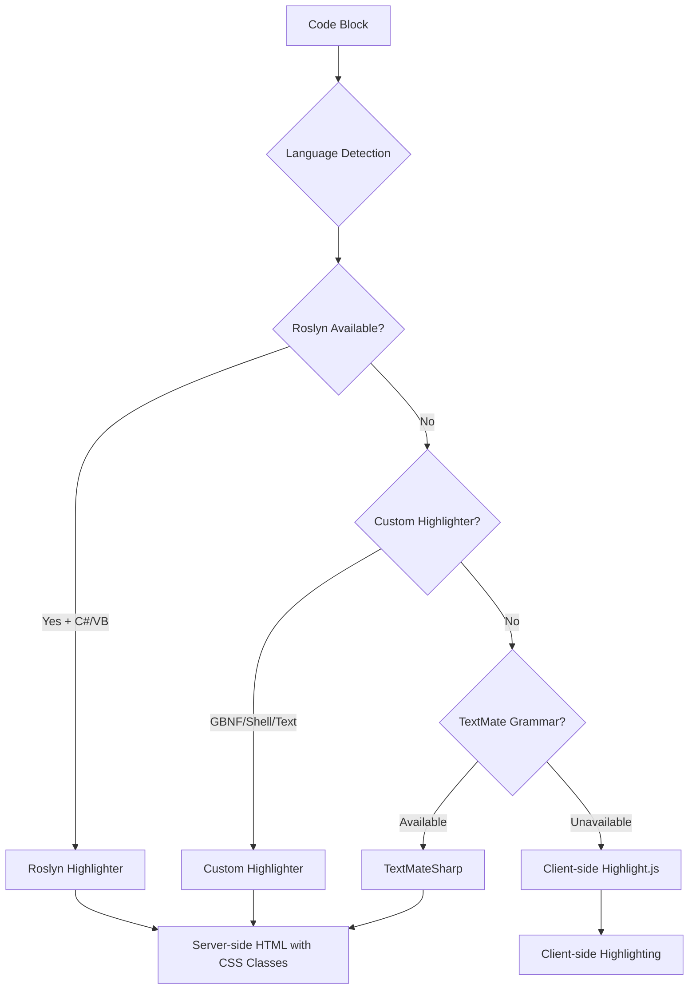

MyLittleContentEngine features a sophisticated multi-layered syntax highlighting system that provides server-side highlighting for optimal performance while maintaining broad language compatibility. The system uses a cascading approach with four different highlighting engines, each optimized for specific use cases.

> [!NOTE]
> To enable Roslyn syntax highlighting for C# and VB.NET, see [Connecting to Roslyn](xref:docs.getting-started.connecting-to-roslyn). For information about styling syntax highlighting, see [Monorail CSS Configuration](xref:docs.reference.monorail-css-configuration).

## Architecture Overview

The syntax highlighting system follows a priority-based cascade that maximizes accuracy and performance:



This layered approach ensures that:
- **C# and VB.NET** get the most accurate highlighting via Roslyn
- **Common languages** are highlighted server-side for better performance
- **Specialized languages** receive custom tokenization
- **Any language** can be handled via client-side fallback

## Layer 1: Roslyn Highlighter (Highest Priority)

The Roslyn highlighter provides the most accurate syntax highlighting for .NET languages by leveraging Microsoft's actual C# and VB.NET compilers.

### Supported Languages

| Language | Identifiers | Engine |
|----------|-------------|---------|
| C# | `csharp`, `c#`, `cs` | Microsoft.CodeAnalysis.Classification |
| Visual Basic | `vb`, `vbnet` | Microsoft.CodeAnalysis.Classification |

### Special Roslyn Features

#### XML Documentation Integration
```markdown
```csharp:xmldocid
T:System.Collections.Generic.List<T>.Add
```
```

This extracts the actual implementation of `List<T>.Add` from the loaded assemblies and highlights it with full semantic information.

#### File Path Loading
```markdown
```csharp:path
examples/MinimalExample/Program.cs
```
```

Loads and highlights external files from your solution, ensuring documentation stays in sync with actual code.

#### Body-Only Documentation
```markdown
```csharp:xmldocid,bodyonly
M:MyNamespace.MyClass.MyMethod
```
```

Shows only the method body without class declaration context.

### Implementation Details

The Roslyn highlighter operates by:
1. **Loading Solutions**: Scans referenced assemblies and XML documentation
2. **Semantic Analysis**: Uses full compiler semantic information
3. **Classification**: Applies precise token classification (keywords, types, literals, etc.)
4. **HTML Generation**: Outputs semantic HTML with CSS classes matching Highlight.js conventions

**Key Classes:**
- `RoslynHighlighterService`: Main highlighting service
- `RoslynExampleCoordinator`: Handles XML documentation extraction
- `CodeExecutionService`: Manages assembly loading and reflection

## Layer 2: Custom Highlighters

Custom highlighters provide specialized tokenization for domain-specific languages that benefit from purpose-built parsers.

### GBNF (Grammar Backus-Naur Form)

**Language**: `gbnf`
**Purpose**: Highlighting grammar definitions for language parsers

```gbnf
root ::= expr
expr ::= term (("+" | "-") term)*
term ::= factor (("*" | "/") factor)*
factor ::= number | "(" expr ")"
number ::= [0-9]+
```

**Features:**
- **Rule Detection**: Identifies grammar rule definitions
- **Operator Highlighting**: Highlights GBNF operators (`::=`, `|`, `*`, `+`, `?`)
- **String Literals**: Recognizes quoted terminal symbols
- **Character Ranges**: Highlights bracket notation `[a-z]`
- **Comments**: Supports `//` line comments

**Token Types:**
- `RuleName` → `hljs-variable`
- `StringLiteral` → `hljs-string`
- `CharRange` → `hljs-regexp`
- `Operator` → `hljs-operator`
- `Comment` → `hljs-comment`

### Shell/Bash Highlighter

**Languages**: `bash`, `shell`
**Purpose**: Command-line script highlighting with semantic understanding

```bash
#!/bin/bash
# Install dependencies
curl -sfL https://example.com/install.sh | tar -xzf -
dotnet build --configuration Release
```

**Features:**
- **Command Recognition**: Identifies shell commands and built-ins
- **Flag Highlighting**: Recognizes command-line flags (`-f`, `--verbose`)
- **String Detection**: Handles single and double-quoted strings
- **Comment Support**: Highlights `#` and `REM` comments
- **Shebang Support**: Recognizes script interpreters

**Token Mapping:**
- Commands → `hljs-built_in`
- Flags/Options → `hljs-params`
- Strings → `hljs-string`
- Comments → `hljs-comment`

### Plain Text Handler

**Languages**: `text`, `` (empty string)
**Purpose**: Renders code without syntax highlighting

Simply wraps content in `<pre><code>` tags with HTML escaping, providing a fallback for content that shouldn't be highlighted.

### Implementation Architecture

```csharp
// Custom highlighter interface pattern
internal static class GbnfHighlighter
{
    public static string Highlight(string gbnfText)
    {
        var tokens = TokenizeGbnf(gbnfText);
        return ConvertTokensToHtml(tokens);
    }
    
    private static List<Token> TokenizeGbnf(string text)
    {
        // Custom tokenization logic using regex patterns
    }
}
```

## Layer 3: TextMateSharp Integration

TextMateSharp provides broad language support using Visual Studio Code's grammar definitions, offering server-side highlighting for 49+ programming languages.

### Language Coverage

#### Web Technologies
- **Frontend**: HTML, CSS, SCSS, Less, JavaScript, TypeScript
- **Data**: JSON, XML, YAML
- **Templates**: Handlebars, Pug, Razor

#### Systems Programming
- **Native**: C, C++, Rust, Go, Swift, Objective-C
- **Managed**: Java, Kotlin, Dart, Pascal

#### Scripting & Dynamic
- **Python**: Full Python 3 syntax support
- **Ruby**: Including Rails-specific highlighting
- **PHP**: Web-focused syntax highlighting
- **PowerShell**: Windows scripting support
- **Lua**: Lightweight scripting language
- **R**: Statistical computing language

#### Functional Programming
- **F#**: .NET functional language
- **Clojure**: JVM-based Lisp dialect
- **Julia**: Scientific computing language

#### Documentation & Markup
- **Markdown**: Including extensions and frontmatter
- **LaTeX**: Mathematical typesetting
- **AsciiDoc**: Technical documentation
- **Typst**: Modern markup language

#### Specialized Languages
- **HLSL/ShaderLab**: Graphics programming
- **SQL**: Database queries
- **Groovy**: JVM scripting
- **Dockerfile**: Container definitions

### TextMate to Highlight.js Mapping

The system maps TextMate token scopes to Highlight.js CSS classes for consistent styling:

```csharp
private static readonly List<Tuple<string, string>> ScopeMappings = [
    // Comments
    Tuple.Create("comment.line.double-slash", "hljs-comment"),
    Tuple.Create("comment.block.documentation", "hljs-comment"),
    
    // Keywords and Storage
    Tuple.Create("keyword.control", "hljs-keyword"),
    Tuple.Create("storage.type", "hljs-keyword"), 
    Tuple.Create("storage.modifier", "hljs-keyword"),
    
    // Strings and Literals
    Tuple.Create("string.quoted.interpolated", "hljs-string"),
    Tuple.Create("constant.numeric", "hljs-number"),
    Tuple.Create("constant.language", "hljs-literal"),
    
    // Types and Functions
    Tuple.Create("entity.name.function", "hljs-title"),
    Tuple.Create("entity.name.type", "hljs-type"),
    Tuple.Create("support.function", "hljs-built_in"),
    
    // Variables and Members
    Tuple.Create("variable.parameter", "hljs-variable"),
    Tuple.Create("variable.other.member", "hljs-attr")
];
```

### Performance Characteristics

- **Thread Safety**: Registry access is synchronized with locks
- **Timeout Protection**: 5-second limit on tokenization to prevent hangs
- **Grammar Caching**: TextMate grammars are loaded and cached on first use
- **Scope Resolution**: Attempts multiple scope name patterns for maximum compatibility

### Fallback Behavior

When a requested language isn't found:
1. **Scope Name Generation**: Tries `source.{language}` pattern
2. **Alias Resolution**: Attempts common language aliases
3. **Plain Text Fallback**: Renders as plain code block if no grammar found

## Layer 4: Client-Side Highlight.js (Fallback)

When server-side highlighting isn't available, the system falls back to client-side Highlight.js for maximum language compatibility.

### Pre-loaded Languages (23)

High-frequency languages loaded immediately:
- **Web**: `javascript`, `typescript`, `css`, `html`, `xml`, `json`, `yaml`
- **Systems**: `cpp`, `c`, `rust`, `go`, `java`, `kotlin`, `swift`
- **Scripting**: `python`, `php`, `ruby`, `bash`, `shell`
- **Data**: `sql`, `markdown`
- **.NET**: `csharp`

### Language Aliases

```javascript
const languageAliases = {
    'js': 'javascript',
    'ts': 'typescript',
    'cs': 'csharp',
    'py': 'python',
    'sh': 'bash',
    'yml': 'yaml'
};
```

### Dynamic Loading

For uncommon languages, Highlight.js loads additional grammars from CDN:

```javascript
// Lazy load additional languages from CDN
const response = await fetch(`https://cdn.jsdelivr.net/npm/highlight.js@11/lib/languages/${language}.min.js`);
```

This provides access to 190+ languages without increasing initial bundle size.

### Client-Side Implementation

```javascript
class SyntaxHighlighter {
    async highlightCodeBlocks() {
        const codeBlocks = document.querySelectorAll('pre code:not(.hljs)');
        for (const block of codeBlocks) {
            const language = this.detectLanguage(block);
            if (language && !hljs.getLanguage(language)) {
                await this.loadLanguage(language);
            }
            hljs.highlightElement(block);
        }
    }
}
```

## Integration and Configuration

### Markdig Pipeline Integration

The syntax highlighting system integrates with Markdig through the `ColorCodingHighlighter` extension:

```csharp
public void Setup(MarkdownPipeline pipeline, IMarkdownRenderer renderer)
{
    // Replace default CodeBlockRenderer
    var codeBlockRenderer = htmlRenderer.ObjectRenderers.FindExact<CodeBlockRenderer>();
    if (codeBlockRenderer != null)
    {
        htmlRenderer.ObjectRenderers.Remove(codeBlockRenderer);
    }
    
    // Add enhanced CodeHighlightRenderer
    htmlRenderer.ObjectRenderers.AddIfNotAlready(
        new CodeHighlightRenderer(roslynHighlighter, options)
    );
}
```

### CSS Class Consistency

All highlighting layers output CSS classes compatible with Highlight.js themes:

| Purpose | CSS Class | Usage |
|---------|-----------|-------|
| Keywords | `hljs-keyword` | `public`, `class`, `if` |
| Types | `hljs-type` | `string`, `MyClass` |
| Strings | `hljs-string` | `"hello world"` |
| Numbers | `hljs-number` | `42`, `3.14` |
| Comments | `hljs-comment` | `// comment` |
| Functions | `hljs-title` | Function names |
| Variables | `hljs-variable` | Variable names |
| Built-ins | `hljs-built_in` | `console.log` |

### Configuration Options

The system supports customization through `CodeHighlightRenderOptions`:

```csharp
public record CodeHighlightRenderOptions
{
    public string OuterWrapperCss { get; init; } = "code-highlight-wrapper not-prose";
    public string StandaloneContainerCss { get; init; } = "standalone-code-container";
    public string PreBaseCss { get; init; } = "";
    public string PreStandaloneCss { get; init; } = "standalone-code-highlight";
}
```

## Performance Optimization

### Server-Side Benefits

- **Reduced JavaScript**: No client-side highlighting for server-rendered code
- **Faster Initial Load**: Pre-highlighted HTML renders immediately
- **SEO Friendly**: Search engines can read highlighted code structure
- **Consistent Rendering**: No flash of unstyled content

### Lazy Loading Strategy

```javascript
// Only load Highlight.js when needed
if (document.querySelector('pre code.language-unknown')) {
    await import('./highlight-module.js');
}
```

### Memory Management

- **TextMate Grammar Cache**: Grammars cached after first use
- **Regex Compilation**: Generated regex patterns for optimal performance
- **Token Reuse**: Minimizes object allocation during tokenization

## Error Handling and Resilience

### Graceful Degradation

1. **Roslyn Unavailable**: Falls back to TextMateSharp or custom highlighters
2. **Grammar Not Found**: Falls back to client-side highlighting
3. **Client-Side Failure**: Displays plain text with basic styling
4. **File Loading Errors**: Shows error message instead of crashing

### Security Considerations

- **File Path Validation**: Restricts file access to solution directory
- **Timeout Protection**: Prevents infinite loops in tokenization
- **HTML Escaping**: All user content is properly escaped
- **CDN Integrity**: Client-side libraries loaded with integrity checks

## Extension Points

### Adding Custom Highlighters

```csharp
// Custom highlighter example
internal static class CustomLanguageHighlighter
{
    public static string Highlight(string code)
    {
        var tokens = Tokenize(code);
        return GenerateHtml(tokens);
    }
}

// Integration in CodeHighlightRenderer
case "customlang":
    renderer.Write(CustomLanguageHighlighter.Highlight(code));
    break;
```

### Theme Integration

The system is designed to work with any Highlight.js-compatible theme:

```css
/* Custom theme example */
.hljs-keyword { color: #ff7b72; }
.hljs-string { color: #a5d6ff; }
.hljs-comment { color: #8b949e; }
.hljs-type { color: #79c0ff; }
```

## Summary

MyLittleContentEngine's syntax highlighting system provides comprehensive language support through a carefully orchestrated multi-layer architecture:

- **52+ server-side languages** for optimal performance
- **190+ client-side languages** for maximum compatibility  
- **Specialized handling** for domain-specific languages
- **Semantic accuracy** for .NET languages via Roslyn
- **Consistent theming** across all highlighting engines
- **Progressive enhancement** from server-side to client-side
- **Extensible architecture** for adding new languages and highlighters

This approach ensures fast, accurate syntax highlighting while maintaining broad language compatibility and excellent user experience.