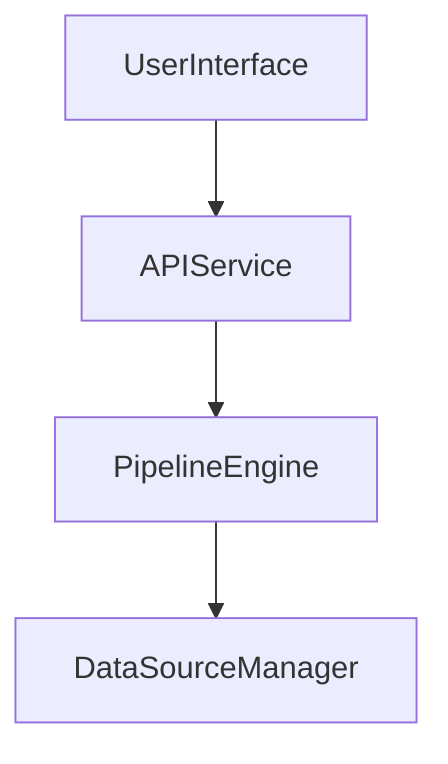

Welcome to the CloudFlow Documentation! Here you'll find everything you need to master the platform, from setup to troubleshooting. This guide is packed with fake but illustrative examples, sample configs, and technical tips.


## Platform Overview

CloudFlow is engineered for data wrangling, transformation, and automation. Whether you're processing fake CSVs or streaming imaginary IoT data, CloudFlow has you covered.

```yaml
platform:
  name: CloudFlow
  version: "v0.0.42-fake"
  features:
    - pipeline orchestration
    - data source integration
    - error handling
```


### Core Features

- Drag-and-drop pipeline builder
- Real-time fake data monitoring
- Built-in support for imaginary file formats


### Architecture Principles

CloudFlow is built on microservices, each named after a famous fictional scientist. All services communicate via the `FAKEBUS` protocol.




## Getting Started

Ready to build your first fake pipeline? Jump to the Getting Started guide for step-by-step instructions and sample commands.


### Prerequisites

- Operating System: Windows 95 or newer
- RAM: At least 1 unicorn
- Disk Space: Infinite


### Installation Requirements

Install with the following command:

```bash
fakeflow install --magic
```


## Documentation Structure

This documentation is organized by topic. Each section contains fake but illustrative examples, config snippets, and troubleshooting tips.


### User Guides

Learn how to use CloudFlow with step-by-step guides, including how to process imaginary data and debug non-existent errors.


### API Documentation

See the API Reference for fake endpoints, sample requests, and error codes.


### Configuration References

Find sample configuration files and tips for tuning your fake CloudFlow deployment.